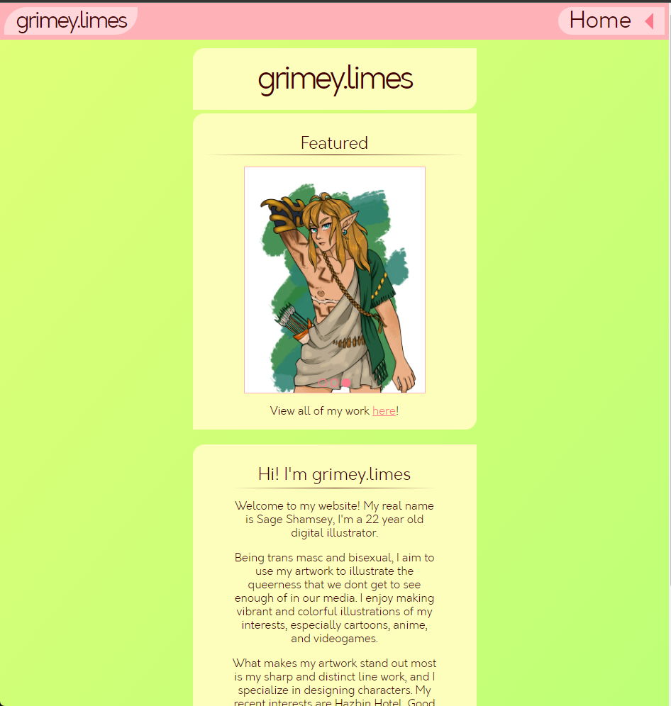
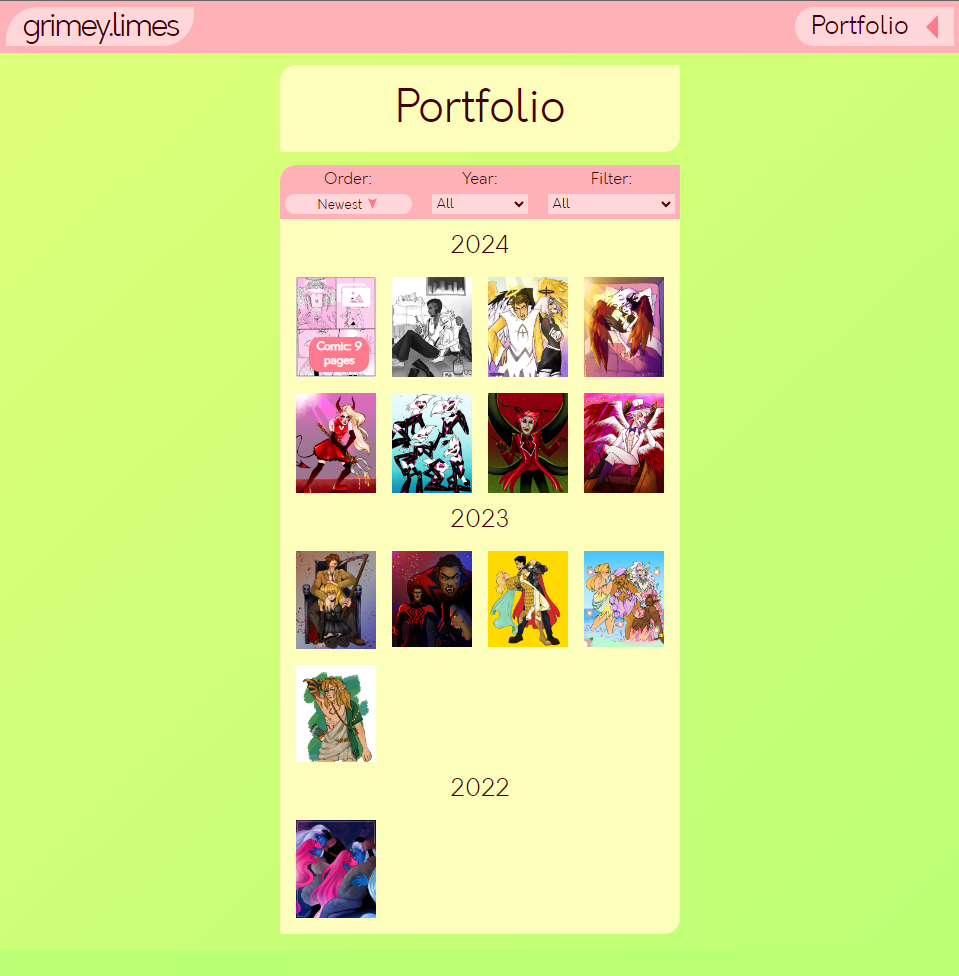
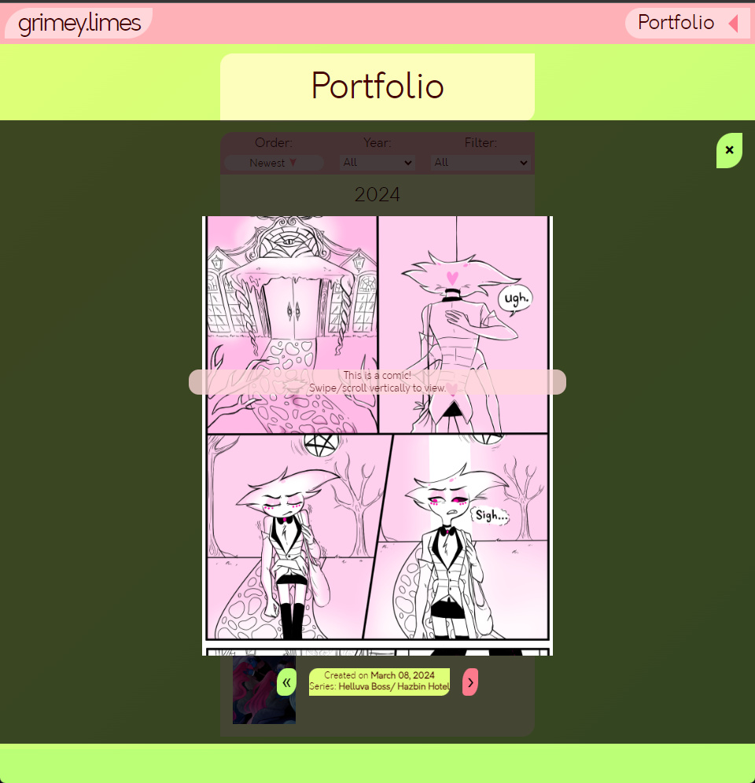

# grimeylimes art portfolio

This website is an art portfolio for an online digital artist known 
as ***grimeylimes***. It's a site where all of his art is gathered
in one place and to be viewed by those looking to commission him or
who are just interested in seeing everything in one place.

### Live Website:
[marco-dlc.github.io/grimeylimes](https://marco-dlc.github.io/grimeylimes)

## Features:

- ### Home page:
- An about me section.
- Three featured art pieces in a slideshow.

- ### Portfolio page:
- All of client's artworks grouped by year.
- A filter which can allow users to filter art by year, series the art depicts, comics, drawings.
- Users can switch from seeing the newest first to seeing oldest first.
- When users click an image, it opens up in a larger view port, and displays more information
about the art such as its date of creation and series it's from.
- Users can either click left and right arrows to cycle through the artwork on display, but they
can also swipe horizontally if they're on mobile, scroll or click and drag if they're on other
devices.
- When a user is viewing an art piece with multiple pages like a comic, they can swipe vertically
to view each panel. This allows for a more seamless viewing.

- ### **Note:** 
    The art is fetched from a local JSON file, with urls linking to the local artwork 
files. This was meant to be temporary, in order for me to get a handle on working with
fetching data and working with a backend. However, The client abandoned this project for
personal reasons. The plan was to fetch the artwork from an online JSON file with url links to
the art image files which would have been uploaded online by the client to a remote location.  

- ### Commissions page:
- Link to email address and social media for customers to contact the artist about commissions.
- Details and pricing sheet.

- ### Social Media page:
- Link to all social media accounts.

## Technology used:
- Javascript
- JSON data
- Fetch
- Async functions
- HTML
- CSS
- VSCode
- Git